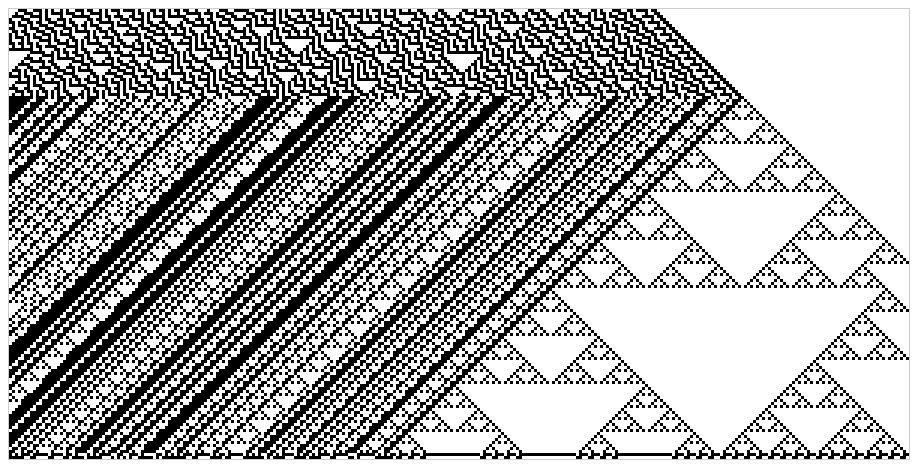
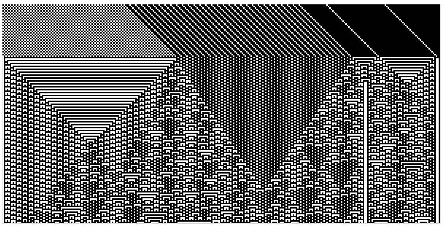
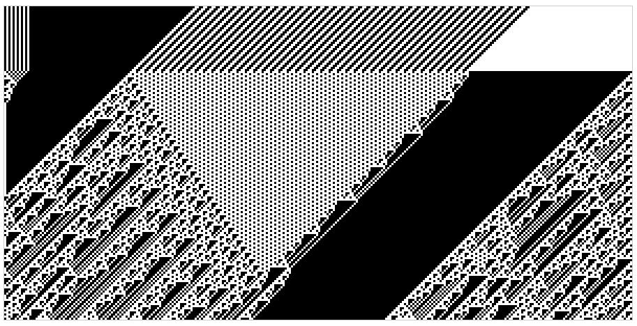
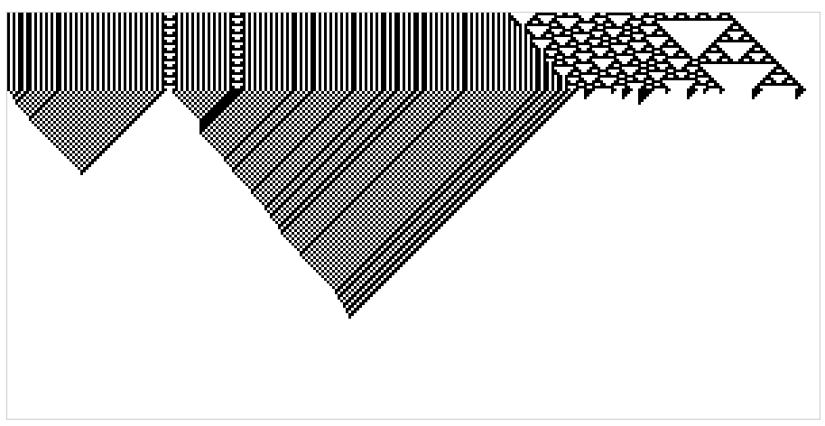
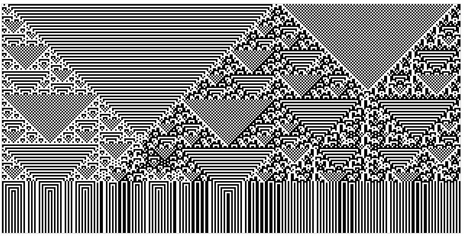
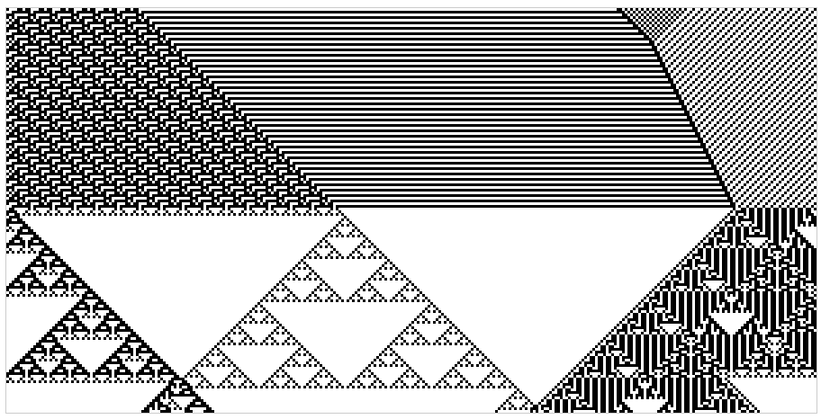

## Cellular Automata

A simple JavaScript application that demonstrates one-dimensional Cellular
Automata as per Tom Stuart's [Understanding Computation](http://computationbook.com/).

## Demonstration

There's a demonstration of it running [here](http://tuzz.github.io/cellular-automata/).

## How to setup

Just run `make`. You'll need nodejs on your system.

## Screenshots

---

---

---

---

---

---

